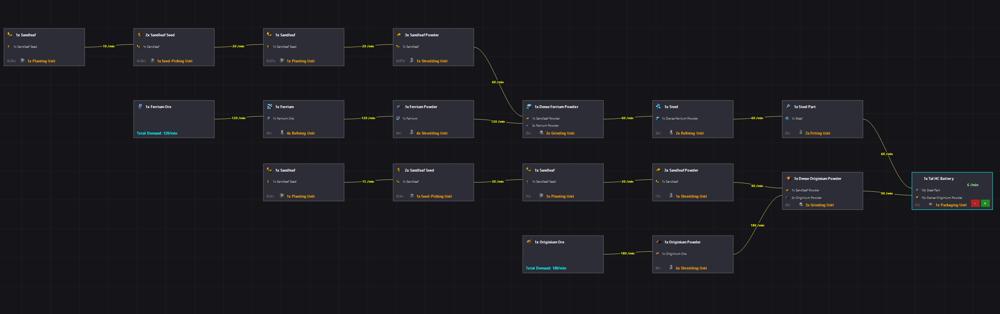

# Arknights: Endfield Simple Modeler

A lightweight **Windows Forms tool** for tracking and managing production lines in *Arknights: Endfield*.  
Built quickly to help visualize big production setups and keep things organized.

## Disclaimer
- This is an early version: not all items or icons are implemented.  
- Bugs or missing features may appear.  
- Created in just a few hours for personal use, shared here in case it helps someone else.  
- The workspace **does not save**, since only one production line is shown at a time.  
- I don’t know when or if I will update this, but at least it exists

## Features
- Track **one production line at a time**  

## How to use
1. Run the program.  
2. **Left-click and drag** to move around the workspace.  
3. **Right-click** to open the list of production lines and search.  
4. Click a production line from the list → the full line is created on the workspace.  
5. Nodes are **moveable** and display:  
   - Production item  
   - Production need  
   - Machine required and how many  
6. Node connections show **parts per minute**.  
7. On the production line **END node**, use **+ / -** to increase/decrease the amount.  
8. For ores, the **total demand per minute** is displayed.

## Screenshots
### Tal-HC-Battery Production Line

### Dense Ferrium Powder Production Line

