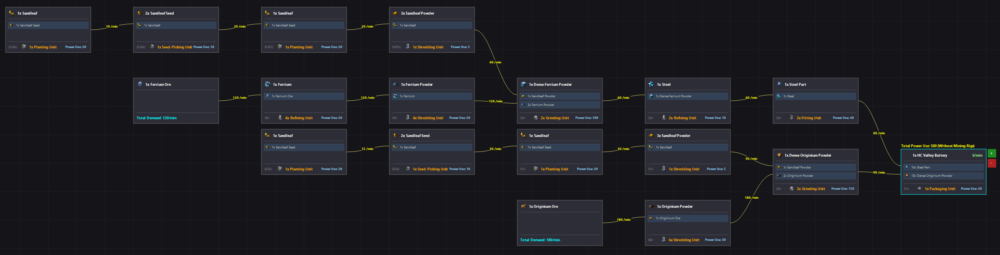
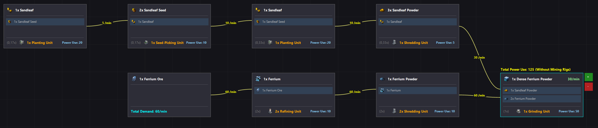

# Arknights: Endfield Simple Modeler (AESM)

A lightweight **Windows Forms tool** for tracking and managing production lines in *Arknights: Endfield*.  
Designed to help visualize large and complex production setups.

## Disclaimer
- This is an **early version**; not all items or icons are implemented.  
- Bugs, incorrect information, or missing features may occur.  
- The workspace **does not save**, since only one production line is shown at a time.  

## How to use
1. **Unzip** the downloaded release ZIP **`aesm-v%VERSION%.zip`**.  
2. Start the program by running **`EndfieldModeler.exe`**.   
3. Use the **controls in the top-right corner** of the app.
======================================================================
4. To create a new production line, press the **“Create new Production Line”** button at the top.  
5. Nodes are **moveable** and display:  
   - Produced item
   - Required inputs  
   - Required machines and their quanity 
   - Power consumption
6. Connections between nodes display **parts per minute** 
7. On the production line **END node**, use **+ / -** to increase/decrease the output amount.  
8. For ores, the **total demand per minute** is displayed.  
9. On the **END node**, the **total power consumption** of the production line is shown *(excluding mining rigs)*.  
======================================================================
10. **Undo/Redo node movement:**  
    - `Ctrl + Z` → Undo
    - `Ctrl + Y` → Redo 
11. **Zoom:**  
    - Use the **mouse wheel** to zoom in or out of the workspace

## Screenshots
### HC Valley Battery Production Line

### Dense Ferrium Powder Production Line

